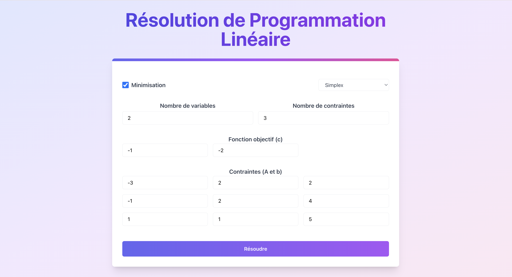

# Résolution de Programmation Linéaire avec Simplex, Big M et Simplex à deux phases

Cette application permet de résoudre des problèmes de programmation linéaire en utilisant les méthodes **Simplex**, **Big M** et **Simplex à deux phases**. L'interface web interactive permet de saisir les coefficients de la fonction objective et des contraintes, et d'obtenir une solution optimale pour les problèmes de maximisation ou de minimisation.

## Fonctionnalités principales

- **Interface web dynamique** pour saisir et ajuster les paramètres du problème.
- Résolution de programmation linéaire avec les méthodes :
  - Simplex
  - Big M
  - Simplex à deux phases
- Affichage de la solution optimale et de la valeur optimale en temps réel.
- Support pour les problèmes de maximisation et minimisation.

## Interface utilisateur

L'interface est conçue pour être simple et intuitive. Elle permet à l'utilisateur de :
- Entrer le nombre de variables et de contraintes.
- Modifier les coefficients de la fonction objective et des contraintes.
- Choisir la méthode de résolution (Simplex, Big M ou Simplex à deux phases).
- Voir immédiatement les résultats après avoir soumis le problème.

## Aperçu de l'application

